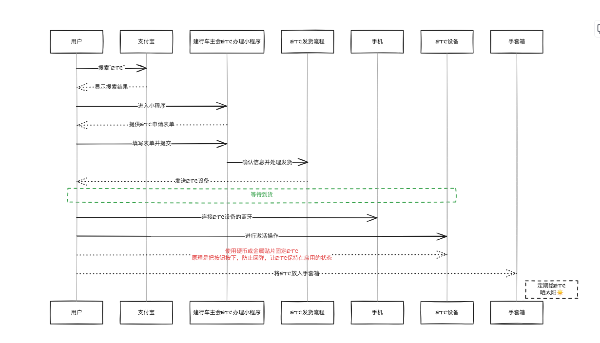

## 锁车音效

[锁车音效](https://www.xiaohongshu.com/explore/6595235f0000000018028ce4)

> 特斯拉U盘插入电脑，下载好的音源粘贴在<mark style="color:red;">根目录</mark>里，重命名为“LockChime.wav”

## 介绍

[Cybertruck介绍](https://www.youtube.com/watch?v=V8wfHbymZow)

## 充电选择

| 品牌   | 优势   | 缺点 |
| ---- | ---- | -- |
| 超充   | 快    |    |
| 特来电  | 停车费  |    |
| 加电   | 离单位近 |    |
| 星星充电 |      |    |
| 蔚来超充 |      |    |
| 国家电网 |      |    |
| 高德搜索 |      |    |

## 行程规划

|      |   |
| ---- | - |
| 特斯拉  |   |
| 特来电  |   |
| 加电   |   |
| 高德地图 |   |

## ETC不要贴在玻璃上

太丑了。 所以别贴在玻璃上。 `less is more !`

## 能量回收制动受限

<figure><figcaption></figcaption></figure>

[解决办法](https://www.tesla.com/ownersmanual/modely/zh\_cn/GUID-3DFFB071-C0F6-474D-8A45-17BE1A006365.html)

> #### 能量回收制动 
>
> 电池温度较低或已充满电时，能量回收制动可能受限
>
> <mark style="background-color:orange;">要确保每次松开加速踏板时都获得相同的减速量</mark>，而不管电池状态如何.
>
> 您可以选择在能量回收制动受限时自动启用常规制动系统。
>
> 点击控制 > 踏板和转向 > 能量回收制动受限时实施制动。
>
> 启用能量回收制动受限时实施制动后，在实施制动时，制动踏板可能会移动，并在踩下时可能会<mark style="color:red;">比较费力</mark>。这是正常现象，不会影响您对 Model Y 减速。
>
> 由于 Model Y 使用能量回收制动，刹车片的使用频率通常低于传统制动系统中的制动片。为了避免锈蚀和腐蚀积聚，Tesla 建议<mark style="color:red;">经常踩下制动踏板，以应用机械制动器并使刹车片和刹车盘变干</mark>。

## 重启能解决99.9999%的问题

> #### [重新啟動觸控螢幕](https://www.tesla.com/ownersmanual/model3/zh\_tw\_us/GUID-518C51C1-E9AC-4A68-AE12-07F4FF8C881E.html#GUID-7462479C-A6D1-4F25-BF1B-4A3899BCA999) 
>
> **同時按住 方向盤 的滾動按鈕直到觸控螢幕變暗**
>
> 

* 网络连接, 比如`无法播放音乐`, `指令无法正常反馈`
* 点击屏幕没有响应

## 院士

[#shang-ye-why-jiang](../books/bo-ke.md#shang-ye-why-jiang "mention")

## 更省电

* 内循环车内温度热的更快, <mark style="color:red;">更省电?</mark>

内外循环自动循环按钮, <mark style="background-color:red;">浅色的标志</mark>

## 冬天使用

* 雨刮器除霜标志
*

## 补漆

[同样价格，整喷和局部补漆怎么选？](https://www.douyin.com/search/%E5%85%A8%E5%96%B7%E5%8D%8A%E5%96%B7%E7%9A%84%E5%8C%BA%E5%88%AB?aid=b42c60c3-0a2b-4644-bd23-3f94e121807e&modal_id=7195543439054753064&publish_time=0&sort_type=0&source=search_sug&type=general)

> 局部补漆： 要求和工艺高
>
> 黑车对局部补漆的要求稍微低一点

[局部喷漆和整喷](https://www.douyin.com/search/%E5%85%A8%E5%96%B7%E5%8D%8A%E5%96%B7%E7%9A%84%E5%8C%BA%E5%88%AB?aid=b42c60c3-0a2b-4644-bd23-3f94e121807e&modal_id=7146904512048024835&publish_time=0&sort_type=0&source=search_sug&type=general)

> 整喷和局部喷漆的整个流程是一样的
>
> 局部位置补漆， 整面清漆覆盖
>
> <mark style="background-color:red;">前杠这种有弧度的地方可以尝试局部喷漆， 机盖和车门不建议局部喷漆</mark>

## 顺风车

[//]: # ([zheng-dian-ting-che-fei.md]&#40;../zheng-dian-ting-che-fei.md&#41;)

## 空调使用

[6分钟超长干货，特斯拉冬季长途最佳实践！](https://v.douyin.com/iNNgA6MA/)

> 距离超充站还有35公里的时候，就可以开启空调预热了
>
> 加速模式调整成<mark style="color:red;">舒适</mark>
>
> 21.5度以上都是热风， 21.5度基础上温度越低越省电
>
> <mark style="color:red;">打开内循环</mark>
>
> 速度100\~110之间

## 物品

防滑链只买铁的那种

随车充： 公牛、挚达

## 隔热膜

### 品牌

龙膜

* 龙膜畅越70

3m

* 前档尊享系列
* 四边畅享系列

威固

### 质保

无质保不付款， 3m质保4年

## 出远门

## 床垫
严丝合缝的， 不要左右空隙的

### 杜邦
[杜邦户外推荐](https://www.xiaohongshu.com/explore/666a84d10000000006005482?xsec_token=AB254ZsheapIk2vsrbcTVKAA4ZNfKR0rA5EpkLdIjKwhE=&xsec_source=pc_search)
- 开模定制
- 挂钩防止往下溜

## 车载用品品牌

杜邦

TESCAMP
- [TESCAMP](https://www.xiaohongshu.com/user/profile/59b8ba2750c4b44e5f46ef4c)

## 微信定位分享

[微信分享位置到车机](https://www.xiaohongshu.com/explore/6290df830000000001026c85)

> <mark style="color:red;">目的地大头针</mark>&#x20;
>
> 分享
>
> 选择特斯拉

## 保险

### 2024横向对比
[保险报价文档](https://docs.qq.com/sheet/DQWZRSUxNV09GQkJT?tab=3foq6m)

### 驾意险

### 公司选择
- ~~tesla自己的APP~~
- 平安, 价格低
- 人保
- 太平洋财险
- **支付宝**

### 投保人选择谁

### 最优时间
前30天到前35天， 是最折扣系数最低的时候

### 最优人选
多找几个业务员， 同样的险种， 让他们报价

### 新能源返点
13~15

### 标配
交强 + 三者 + 车损 
> 不要保险公司自己的保险

### 注意点
尊敬的xxx， 您车牌导为xxx-xxxx的投保方案已生成，保费合计7124.27元，请点击以下链接查看缴费
> 这种信息并不会导致别的报价业务员无法操作， 也就是不会锁单， 不会核销

外地险
> 这种的可能能做到5000以下， 但是听说有人员伤亡比较麻烦

柜台险跟代理那里买的没有区别
> 价格是最贵的， 服务是最好的
> 
> 没区别，去哪里修都可以，就是别买到统筹就行
> 
> 没区别，有区别早就干不下去了
> 
> 没有那个说法，谁会强迫你去哪里修

朋友声称第二年平安的保费能做到4500左右
> 惊呆了

驾乘险就是保险公司自己的险种，可要可不要

## 雨刮器

- 玻璃清洁剂
- 海绵
- 胶条选择硅胶材质
- **垫毛巾**后再安装雨刮
- 还可以换胶条, 富国胶条

### 怎么拉起来

## 油膜

蓝海豚汽车油墨祛除剂
 

