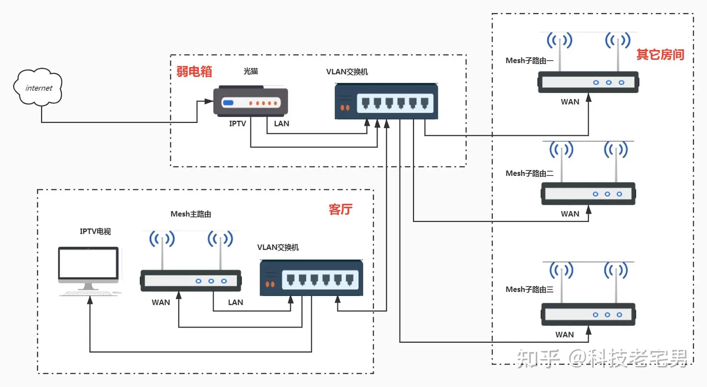

## 参考

[求推荐空气净化器](https://hk.v2ex.com/t/328394)

> 我家用的 BlueAir ，预算高一点可以选 IQAir 。
>
> > 就算你一咬牙买了机器，几个月后换耗材就等着哭吧。

> 新房子 甲醛等 贵的 ; 老房子 PM2.5 小米 ;

> 过滤 PM2.5 主要就是耗材 <mark style="background-color:red;">HEPA 滤网</mark>，其它的都是增值功能。
>
> 按重要程度来排列的话就是：
>
> 1. 滤网（耗材价格 / 污染地区每 3 个月左右换一块）
> 2. 风扇性能（风量，噪音）
> 3. 感应器（ PM2.5 检测）
> 4. 其它功能
>
> 如果只需要过滤 PM2.5 的话，考虑到风扇性能，<mark style="background-color:red;">机器一千以内的就可以了</mark>，耗材去看淘宝什么牌子型号的兼容滤网最多，买那种还便宜点。
>
>
>
> 最麻烦的是感应器，<mark style="background-color:red;">现在空气净化器上搭载的感应器很多都不准</mark>，想要让它 PM2.5 高于 30/50 ug/m3 时自动启动有困难。我自己是另买了一个检测仪控制的。
>
> > <mark style="color:red;">如果不需要自动启动就不用考虑这个</mark>

> 我的房子密封不太好，密封好的效果会更好。
>
> <mark style="color:red;">有的人通过增加房间的密封性, 或者在窗户上贴纸的方式免于被外部环境污染</mark>

> 买个普通的即可，无非是过滤网的材质符合某个标准+风量 /噪音

[小米的空气净化器有用吗？空气净化器是智商税吗](https://hk.v2ex.com/t/1011392)

> 空气净化器有用，但小米的实在不行，<mark style="background-color:red;">噪音太大了</mark>，基本隔着三米都能听到风扇声音

> 至于滤芯过滤等级是 E12 ，H13 级别无所谓，甚至 E11 级都没关系

> 有用，这玩意儿没技术含量，净化功能<mark style="background-color:red;">全靠滤芯</mark>堆料，溢价主要在传感器灵敏度、噪音控制和智能化上。

> 房间 352 ，客厅小米 4 pro ，352 这个不错，就是滤芯太贵了，一个五百多
>
> <mark style="color:red;">那也就是说根据面积进行选择</mark>

> 这东西有没有技术含量，也没有专利门槛，<mark style="background-color:red;">只要建立风道，安排好滤芯，控制好噪音，再加一些智能芯片模块就行了</mark>，所以简单大碗的品牌最好。（也要考虑到滤芯是否有第三方的性价比款）
>
> 如果是超过 3000 的，完全可以买一个壁挂式新风机了。

> 噪音的话跟模式有关，静音模式和全力模式的噪音几乎是一个天一个地；
>
> 小米的话综合外观和价格是非常好的选择，家里有 3 个，<mark style="background-color:red;">客厅选 CADR 大一些的合适，卧室选噪音低的</mark>。

> 我自己用小米，先看评测基本上小米都不会很差。<mark style="background-color:red;">但噪音在中高档的风力确实吵，在意就不要选。</mark>

> 而且小米有一点好，<mark style="background-color:red;">副厂滤芯特别多</mark>。

> 有没有用看滤芯不就得了，小米的槽点是早期的型号拆卸清洗非常麻烦，可以说是反人类。不知道新型号改了没有
>
> <mark style="color:red;">考虑拆卸滤芯是否方便</mark>

> 当家里要放 4 ，5 个净化器的时候，小米的价格优势就体现出来了。<mark style="background-color:red;">一个小米基础款管一个房间还是 OK 的。客厅买个好点的。</mark>
>
> <mark style="color:red;">手机上可以将多个设备联动起来, 比如app一件全部开启, 或者设置自动化, 每天几点开启, 开启多长时间</mark>

### 爱否科技

[爱否 Fview 净化器消费者报告完整版](https://www.youtube.com/watch?v=JkBsxRgFz84)

鼻腔可以阻截大于50微米以上的颗粒

小于50微米以上的颗粒可以抵达鼻腔以及咽喉

小于10微米， 直接抵达气管和支气管

小于5微米， 直接进入我们的肺泡以及毛细血管

[CADR定义](https://zh.wikipedia.org/wiki/CADR%E5%80%BC)：净化器每小时能输出洁净空气的立方数

正常用户房间影响PM2.5的因素

* 抽烟
* 做饭
* 门窗外的空气

墙面会影响CADR值的效果

可移动的PM2.5检测仪

[柴静雾霾调查——穹顶之下 同呼吸共命运（中英字幕） Chai Jing——Under the dome(English subtitles)](https://www.youtube.com/watch?v=rB6TA5g7Pg0)

[小米空气净化器哪个版本最推荐？三个爆款对比：4Pro、Pro H和4 Pro H](https://www.bilibili.com/video/BV11h4y1e7vK/?vd_source=31e016075d5dc418e05dd62618989320)

> 空气净化器吸附的是空气中的微粒(包括[灰尘](https://zh.wikipedia.org/wiki/%E7%81%B0%E5%A1%B5)、[花粉](https://zh.wikipedia.org/wiki/%E8%8A%B1%E7%B2%89)、[细菌](https://zh.wikipedia.org/wiki/%E7%BB%86%E8%8F%8C)、[霉菌](https://zh.wikipedia.org/wiki/%E9%9C%89%E8%8F%8C)等), <mark style="background-color:red;">再大一点的就会落到地上</mark>, 归扫把拖把管辖

