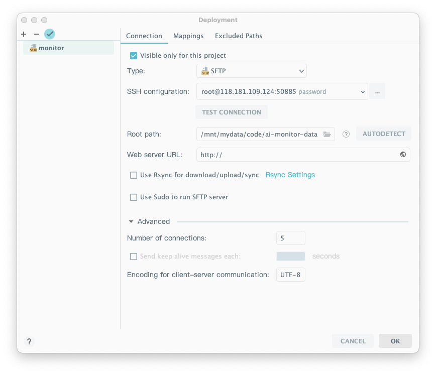
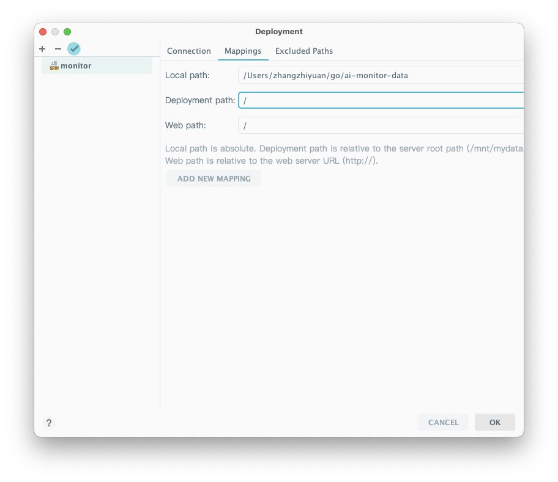

## 远程开发

##

## 代码同步到远程

[Intellij IDEA同步代码至远程FTP服务器](https://blog.csdn.net/banana1006034246/article/details/81534975)

远程路径



本地路径




## 授权服务器

[最终方案采用搞活动的授权服务器](https://github.com/Jetereting/idea-activate?tab=readme-ov-file#6-%E6%9C%80%E7%BB%88%E6%96%B9%E6%A1%88%E9%87%87%E7%94%A8%E6%90%9E%E6%B4%BB%E5%8A%A8%E7%9A%84%E6%8E%88%E6%9D%83%E6%9C%8D%E5%8A%A1%E5%99%A8)

> 1. 打开 [https://idea.jeter.eu.org](https://idea.jeter.eu.org/) 点击中间《获取专属激活地址》的按钮，支付宝扫码支付后，点击《我已捐赠》稍等片刻就能生成专属的服务器授权地址


## 升级闪退

```sh
(base) 0 15:11:26 z:JetBrains $cd /Users/zhangzhiyuan/Library/Application\ Support/JetBrains
(base) 0 15:11:41 z:JetBrains $
(base) 0 15:11:00 z:JetBrains $ls -lt | grep Go
drwxr-xr-x  12 zhangzhiyuan  staff   384  3  4 15:09 GoLand2023.3
```


## 文件权限修改

[macOS IDEA等jetbrain全家桶，Clear Read-Only Status解决方法](https://blog.csdn.net/weixin_45196863/article/details/118833478)

> <mark style="color:red;">`sudo chown -R $USER ./`</mark>


## [<mark style="color:red;">your track</mark>](https://lanzhouoneriver.youtrack.cloud/projects)

[外滩一号测试](https://lanzhouoneriver.youtrack.cloud/projects)


## AI

2024.4.1

[AI Assistant 在 JetBrains IDE 中的可用性](https://sales.jetbrains.com/hc/zh-tw/articles/16544564838162-AI-Assistant-%E5%9C%A8-JetBrains-IDE-%E4%B8%AD%E7%9A%84%E5%8F%AF%E7%94%A8%E6%80%A7)

| [免費開源開發授權](https://www.jetbrains.com/community/opensource/#support)     | 無 |
| ----------------------------------------------------------------------- | - |
| 學生和教師的[免費教育授權](https://www.jetbrains.com/community/education/#students) | 無 |
| 個人使用的個人授權                                                               | 有 |
