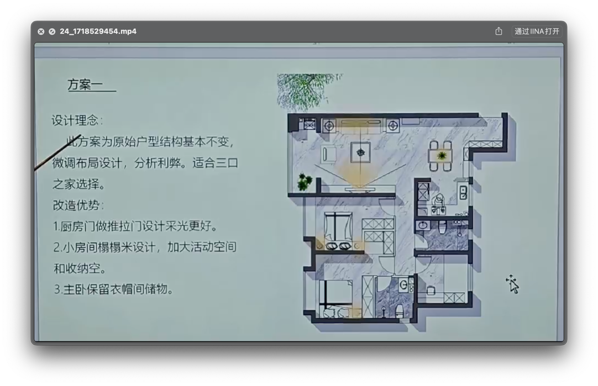

## 房型缺点
- 厨房小
- 收纳少
- 卧室小

## 方案介绍

## 厨房

- [三联动门](https://www.xiaohongshu.com/search_result?keyword=%25E5%258E%25A8%25E6%2588%25BF%25E4%25B8%2589%25E8%2581%2594%25E5%258A%25A8&source=web_explore_feed)
  - 拆除两边局部的墙体
  - 餐边柜是低的那种柜子， 依靠餐边柜和餐桌增加收纳量

## 餐厅

- 吊顶
  - 能够将客厅和餐厅进行一体式拉通的效果， 显大
  

## 书房

- 收纳空间
- 书房功能
- 由于是阴面， 所以颜色选择亮色

## 主卧

- 保留衣帽间
  - 因为保留了衣帽间， 所以次卧就丢失了`学习区`, 所以由书房承担这部分功能
   
- 轨道式的窗帘盒
  - 避免像罗马杆一样漏光
  - 是否智能有待考虑

- 吊顶
  - 根据层高进行考虑

