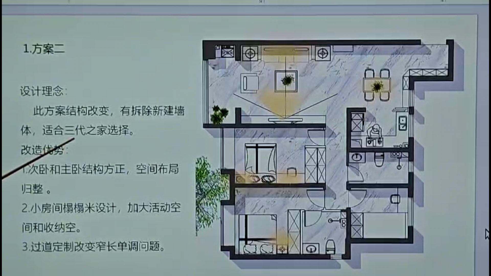
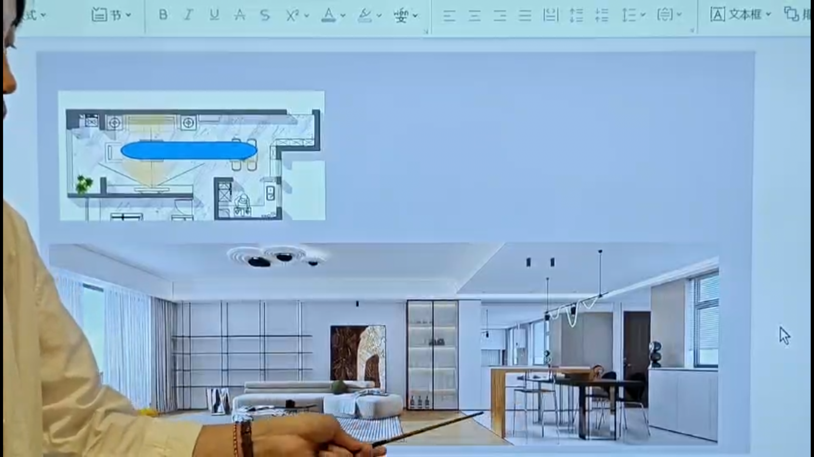
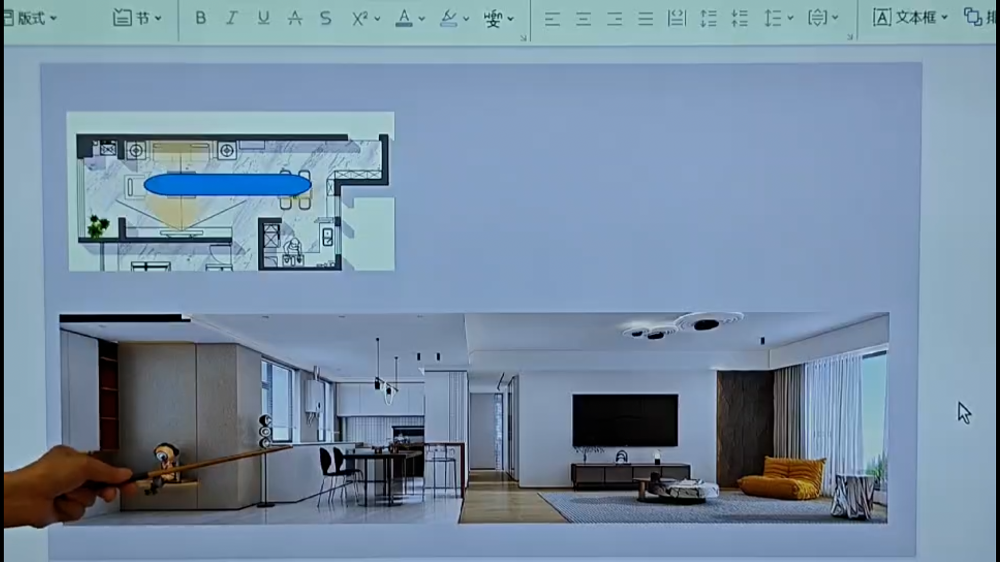
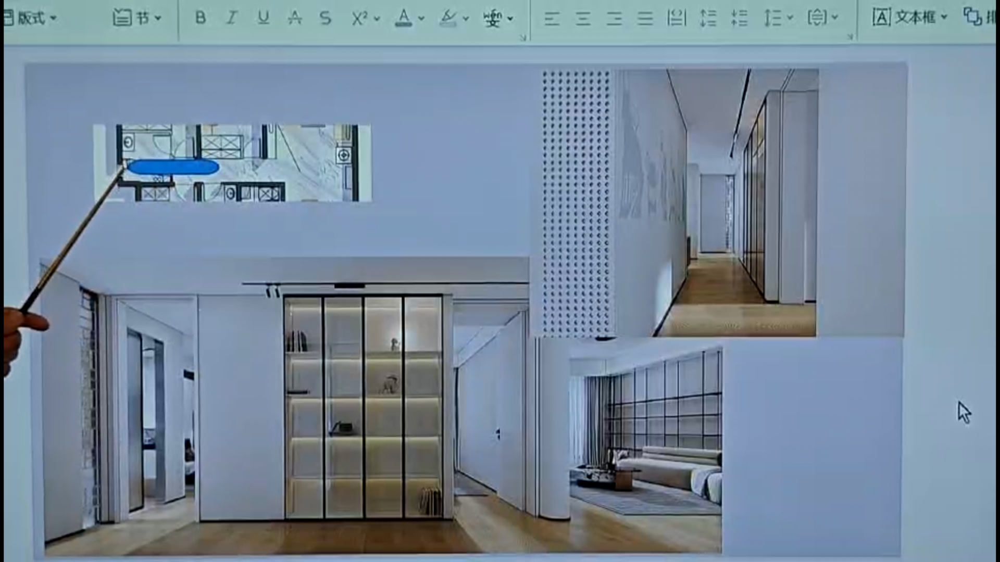

## 房型缺点
- 厨房小
- 收纳少
- 卧室小

## 方案介绍

次卧
- **拆除了承重墙， 做了个背靠背的柜子， 一面在次卧， 一面在走廊**
- 能增加次卧的功能， 例如放置书桌， 
- 户型更加的方正

过道
- 不那么单一了

## 厨房

承重墙
- 三面墙是承重墙
- 只能拆除靠近窗户的墙体， 做成三联动的门

三联动的门
- 关上就是厨房
- 打开就是开放式的厨房

镜子
- 门的同侧方向
- 显得空间更大了

地砖
- 餐厅的地砖是白色的瓷砖， 根据瓷砖的颜色划分功能区

吊顶
- 餐厅和客厅也做了一个划分

## 餐厅

柜子
- 餐边柜和厨房的水槽台面一体延伸

油烟机
- 因为是开放式的厨房， 所以选择了集尘灶
  - 改变烟道方向
  - 吸油烟力更大

**厨房一下子就大了**

## 走廊

- 镜面的柜门
- 主卧室的墙砖使用了部分的玻璃砖

## 主卧

- 因为是自己住， 所以不用考虑私密性

## 书房
