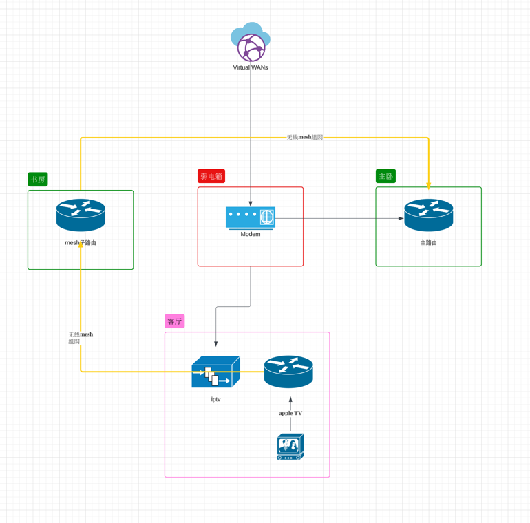

## 单线复用

## 参考链接
[司波图 - 三脚猫网络教程](https://space.bilibili.com/28457/channel/collectiondetail?sid=28414)

光猫改成桥接

路由模式, 主要的功能就是拨号

路由的lan口具备dhcp服务

## 怎么光猫是否拨号

查看光猫下一级的路由器介入的是WAN口还是LAN口
- WAN口, 就是桥接模式
- LAN口, 就是光猫拨号

## 少一层转发NAT

路由的AP模式, 或者桥接模式

或者使用无线路由器的LAN口接入到上一级的路由器, 并且子级的无线路由器的DHCP服务关闭
- 下级路由器的DHCP服务关闭, 只开启上一级的DHCP服务
- mesh组网, 跟这个类似

## 模式1

## 鞋柜弄一层做弱电箱

## 寻线仪

功能
- 确定是否是一根线
- 测试网线接入水晶头后的连通性

寻线仪确定后之后， 记得打好标记和标签

原理

- 启动测试仪，发送端会开始发送电信号，接收端会检测这些信号。
- 根据接收到的信号，测试仪可以判断电缆的每一对导线是否正确连接，是否存在短路、断路或其他连接问题。

## 标签
[小米米家标签打印机套装](https://item.jd.com/100081213046.html)

可以自己根据文字定义

[精臣凡界B1通信线缆智能标签打印机](https://item.jd.com/100053206044.html)

## 案例

[现在房子的网络拓扑](https://lucid.app/lucidchart/f7cacf22-39b1-411e-9ffd-e24a67b9d216/edit?invitationId=inv_ff77544b-462a-4457-bf90-bcff986b83a1)

## 光猫模式

联系运营商修改成桥接模式， 舍弃路由模式
- 光猫只做光电信号转换即可
- 光猫不提供路由的功能以及wifi的功能

## 疑问
光猫桥接后， 是否影响IPTV使用, 如果不影响接线是否变化
