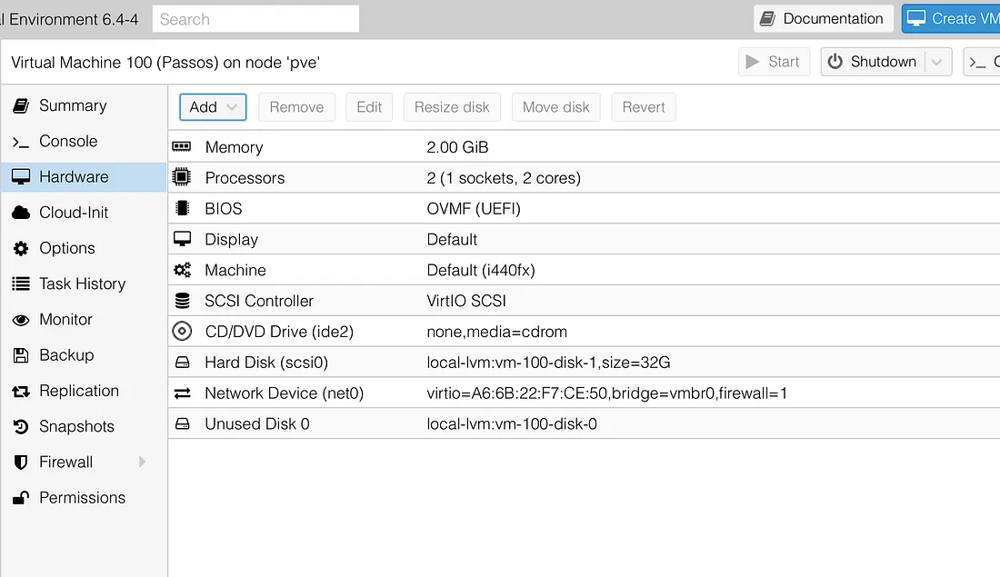

## 参考

[智能家居 . HomeKit全屋智能家居的搭建 . 把家装进iPhone13 · 超长干货](https://www.bilibili.com/video/BV1XL41137kP/?spm_id_from=333.337.search-card.all.click&vd_source=31e016075d5dc418e05dd62618989320)

[智能家居2.0 . 米家天猫如何接入苹果HomeKit . Home Bridge . Home Assistant . 使用教程](https://www.bilibili.com/video/BV1pb4y1B7c8/?spm_id_from=333.999.0.0)


## HomeKit 

与苹果生态系统无缝集成，支持 Siri 语音控制

需要设备制造商提供 HomeKit 兼容性或通过 Homebridge 等工具实现兼容

Homebridge 不是一个独立的平台，而是一个工具，用于扩展 HomeKit 的设备兼容性，适合有一定技术基础的用户。

只支持兼容 HomeKit 的设备，设备种类较为有限

## Home Bridge 

Homebridge 是一个开源的 Node.js 服务器，旨在为不支持 HomeKit 的智能设备提供桥接，使其能够被 HomeKit 识别和控制。

扩展性强：通过插件支持大量不同品牌和类型的设备。

功能： 它充当中介，将各种非 HomeKit 设备“伪装”成 HomeKit 兼容设备，使得用户可以通过 Apple 设备来控制这些设备。常用于让原本不兼容 HomeKit 的设备（如一些智能灯、摄像头等）在 HomeKit 系统中运行。

## Home Assistant
Home Assistant 是一个开源的智能家居平台，旨在本地化管理和自动化控制各种智能设备，提供高度的自定义和扩展能

高度可定制：支持数千种设备和服务，通过 YAML 文件进行配置。

独立的开源智能家居平台


## PVE安装 home assistant
### 依赖文件
proxmox-ve_8.2-2.iso

haos_ova-9.3.qcow2.xz

### 成功案例
[在PVE下安裝Home Assistant](https://medium.com/%E5%BD%BC%E5%BE%97%E6%BD%98%E7%9A%84-swift-ios-app-%E9%96%8B%E7%99%BC%E6%95%99%E5%AE%A4/%E5%9C%A8pve%E4%B8%8B%E5%AE%89%E8%A3%9Dhome-assistant-b6c056678435)

> eMMC是什么
{: .prompt-warning }

### homeassitant前置准备
```markdown
首先登入 PVE 的 webUI，右上角有一個 Create VM（創建虛擬機），接著，你會在 General 看到預設的 VM ID，可以不用更改它，Name 為虛擬機取一個名稱，下一步。

在 OS，選擇 Do not use any media，下一步。
在 System，BIOS 選擇 OVMF（UEFI），下一步。
在 Hard Disk，下一步，因為這個預設的 HD 是將來要 detach 後刪除的，我們會另外導入有 Home Assistant 映像檔的 HD。
在 CPU，Cores 可以選擇 2，即是雙核心。
在 Memory，選擇 2048 MB。
在 Network，Model 選擇 VirtIO（paravirtualized）或 Intel E1000 都可以。
```


> 根据文章的层架结构放置静态图片

**先忽略 Unused Disk 0，點到剛才的 Hard Disk（scsi0），detach 後 Remove。**


### .qcow2

前往homeassistant官网下载 KVM对应的镜像, [链接](https://www.home-assistant.io/installation/linux#download-the-appropriate-image)

> 如 .vmdk，這適用於 ESXi 的檔案，就必須要轉檔。


### 上传.qcow2至PVE

scp XX pveIP


### 转换镜像格式挂载至前置
```shell
qm importdisk 101 hassos_ova-4.11.qcow2 local-lvm
```

### 快完成了，加油！還差一點點。

1. 將 Unused Disk 0 Add 
2. Options 中，更改 Boot Order，取消前面兩個開機選項，將第三個，即是剛剛新加入的 HD 做為開機選項

**在 QEMU Guest Agent 的地方 Enabled，這是為了將來啟動 HA 虛擬機後，能夠在畫面上看到 IP 位址**

### 启动虚拟机
等待系统运行
- homeassitant的UI地址
- homeassitant的健康检查地址


ha-install -t

### 登录homeassitant UI
观察运行日志, 可能就阻塞在拉取镜像

### 设置homeassistant的网关 DNS

[Home Assistant虚拟机版，修改ip地址和网关](https://www.bilibili.com/read/cv17123823/)
> 系统会默认自动分配一个新的ip地址给HA，这就导致了HA的新ip地址因为网关和DNS没有指向旁路由而无法上网
{: .prompt-warning }

**解决这个问题的方法就是手动设置ip地址，网关，DNS这些参数，把HA的网关和DNS指向旁路由，就能解决上网问题了。**

```shell
login
nmcli dev status
```

```
nmcli con edit "Suupervisor enp0s3"
print ipv4
set ipv4.addressess 192.168.31.*/24
# 设置成旁路由的地址
set ipv4.dns 192.168.31.198
set ipv4.gateway 192.168.31.198
print ipv4
save
quit
```

```
nmcli con reload
```

[homeassistants双网卡，固定IP，dns和网关](https://www.bilibili.com/video/BV1yL4y137AX/?spm_id_from=333.976.0.0&vd_source=31e016075d5dc418e05dd62618989320)

### 能做的就只有等待

[当你看到System autofix complete](https://github.com/home-assistant/operating-system/issues/2794)

> I am locking this issue as a simple "me-too" is not helpful here. The message [supervisor.resolution.fixup] System autofix complete is not your problem, that is just typically the last message of a successful Supervisor startup.
{: .prompt-info }


> I just waited, and it eventually started
{: .prompt-info }


---

### 安装ssh命令行

执行安装命令即可
```shell
wget -O - https://get.hacs.xyz | bash -
```

### 系统备份

### 安装HACS
[官方指导](https://www.hacs.xyz/docs/use/download/download/#to-download-hacs-ossupervised)
> 安装后重启, 就出现了无法正常启动的情况
{: .prompt-danger }


[HACS绑定到github](https://www.hacs.xyz/docs/use/configuration/basic/#to-set-up-the-hacs-integration)

### 安装xiaomi auto


### 安装homekit

### 接入家庭的智能设备
接入品牌
- 小米
- 涂鸦
- yeelight
- Aqara
- 自制的传感器


### 备份部署的内容

### 论坛参考

[瀚思彼岸论坛](https://bbs.hassbian.com/thread-24065-1-1.html)

冬瓜HA的改版系统


## apple slicon 安装 home assistant
[[教學] Home Assistant 的安裝方式 - 4. Apple Silicon Mac](https://forum.automata.id/t/topic/334)


## nas docker 安装 home assistant

[利用群晖NAS搭建homeassistant，把米家设备免费接入苹果智能家居HomeKit家庭APP中](https://www.bilibili.com/read/cv15218836/)

### docker 听说有问题


## 场景

1. hey siri， 打开小米电视
2. 


## 教程
### 智能家居Home Assistant搭建从入门到入坑

[智能家居Home Assistant搭建从入门到入坑](https://www.bilibili.com/video/BV1UV411273h/?spm_id_from=333.337.search-card.all.click&vd_source=31e016075d5dc418e05dd62618989320)

#### 为什么需要homeassistant

节假日都不可能准确获取, 假如用传统的智能家居, 不准确, 基本按照周几固定

不能做到只能弹性的起床时间, 实时监测路况

**不能因为只能选择了质量一般的产品**, 但是传统的智能家居, 很多都是标准化质量的低端产品, 无法接入到现有的生态
- 难道什么东西都是小米的做的最好吗

#### 注意事项

24小时后台执行的

#### 自动搜刮出互联网设备
小米的需要key,或者token


#### 推荐路由器

梅林固件的华硕路由器


#### HACS
应用商店, 就像苹果的APPStore


###  群辉NAS搭建HomeAssistant
[利用群晖NAS搭建homeassistant，米家设备免费接入HomeKit](https://www.bilibili.com/video/BV1rS4y1C7nk/?spm_id_from=333.337.search-card.all.click&vd_source=31e016075d5dc418e05dd62618989320)


### 用威联通NAS搭建HomeAssistant
[用威联通NAS搭建HomeAssistant把米家设备接入HomeKit｜HomeAssistant搭建教程｜智能家居](https://www.bilibili.com/video/BV1u34y1E7aP/?spm_id_from=333.337.search-card.all.click&vd_source=31e016075d5dc418e05dd62618989320) 

#### NAS推荐

威联通TS-564

硬盘是: 东芝N300


## 官方文档
[官方文档](https://www.home-assistant.io/installation/macos)

